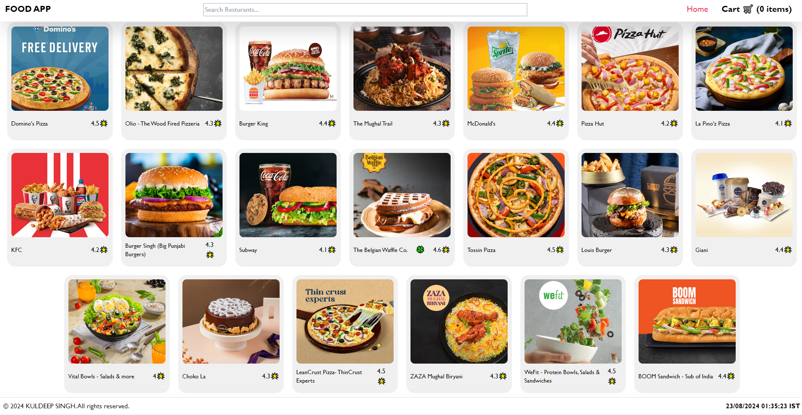
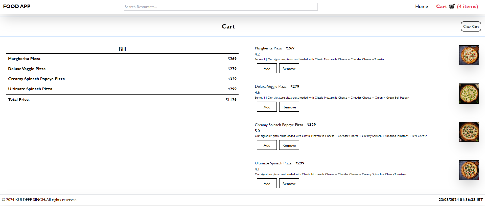

# Food-Delivery-Website

This project is a dynamic and responsive food delivery website built using ReactJS, Tailwind CSS, and various npm packages. The website allows users to browse a selection of food items, add them to their cart, and proceed to checkout. The focus was on creating a clean, user-friendly interface that enhances the overall user experience, making online food ordering simple and efficient.

## Features
- **Responsive Design**: The website is fully responsive, providing an optimal viewing experience across various devices.
- **Interactive UI**: Users can easily navigate through the menu, view item details, and manage their cart.
- **State Management**: Efficient state management ensures that the cart and other interactive elements function smoothly.

## Front View of the Website

## Cart

## Note
If you are accessing my website, please add the **Allow CORS: Access-Control-Allow-Origin** extension in your browser.

Press the link to download:
[Allows:Cors](https://chromewebstore.google.com/detail/allow-cors-access-control/lhobafahddgcelffkeicbaginigeejlf?hl=en)
