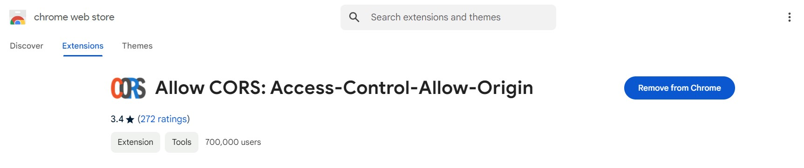

Visit the Website :-


Note : If you are accessing my website [https://tastzy-kuldeep-singhs-projects-375b7bdc.vercel.app//] . 


# Food Ordering Application

A modern food ordering application built using **ReactJS**, **Tailwind CSS**, and **Parcel.js**. The application integrates with live APIs to fetch real-time data, offering users a seamless experience for browsing and ordering food.

---

## Features

- **Real-Time API Integration**: Fetches live data from Swiggy's API.
- **Responsive Design**: Fully optimized for mobile, tablet, and desktop using Tailwind CSS.
- **Component-Based Architecture**: Over 25 reusable components for enhanced modularity.
- **Efficient State Management**: Powered by Redux for a smooth and scalable user experience.
- **Fast Build Tool**: Uses Parcel.js for lightning-fast builds and zero-config development.

---

## Tech Stack

- **Frontend**: ReactJS, Tailwind CSS
- **State Management**: Redux
- **Build Tool**: Parcel.js
- **API**: Swiggy's public API

---

## Installation

Follow these steps to set up the project locally:

1. **Clone the Repository**
   ```bash
   git clone https://github.com/iamkuldeep05/Food-Delivery-Website.git
   cd Food-Delivery-Website

2. **Install Dependencies**
    ```bash
    npm install

3. **Run the Development Server**
    ```bash
    npm start
    
4. **Build for Production**
    ```bash
    npm run build
    
# Deployment

The application is deployed using Vercel. To deploy your own version:

**Push your code to GitHub.**

**Connect your GitHub repository to Vercel.**

**Configure the build command as npm run build and the output directory as dist/.**

**Deploy the application.**

# Contact

If you have any questions or feedback, feel free to reach out:

Email: kuldeepsingh050600@gmail.com
<br>
GitHub: iamkuldeep05


Please add <b> Allow CORS: Access-Control-Allow-Origin </b> this extension in your browser.

